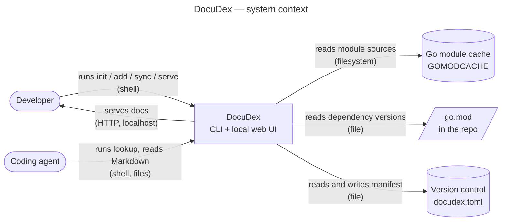

import { Aside, KeyIdea } from '../assets/LessonLayout'
import { Categorise } from '../assets/Categorise'
import { Checklist } from '../assets/Checklist'
import { Quiz } from '../assets/Quiz'

**The win for today:** two diagrams in the DocuDex design doc — a system
context diagram and a container diagram — in Excalidraw, each titled, each
line labelled with what flows and how. About thirty-five minutes. C4 is
notation-independent, so the tool is yours; export each drawing as SVG with
"embed scene" on, so the picture is also the editable source, and commit it
beside the design doc so it changes when the doc does. The context diagram in
section 3 is given as Mermaid text only so it fits in a lesson — read it as a
list of boxes and lines, then draw it.

## What to do (read this first)

1. Draw the **context diagram**: DocuDex as one box; every person and every
   external system it touches; one labelled line per interaction. Section 3
   gives you this one drawn.
2. Draw the **container diagram**: open the DocuDex box; one box per thing
   that runs or stores data; labelled lines with the technology. Section 4
   has the prompts.
3. Give each a title, a one-line legend, and run the checklist.
4. Export both as SVG (embed scene on) beside the design doc and embed
   them: context under *Context and scope*, container at the top of
   *Design*. Update the fetch step while you are
   there — after the POC it is "module cache + `go/doc`", not a downloader.

<KeyIdea>
	A diagram earns its place when a reader would otherwise ask "which box talks to which?" For a
	one-to-three page design doc that is usually one or two diagrams — C4's context and container
	levels — and never the component level. Every line on them carries a label, a direction and a
	technology, or it is decoration.
</KeyIdea>

## 1. C4 in five minutes

Simon Brown's [C4 model](https://c4model.com/) is four zoom levels for the
same system. **System context**: the system as one box, with the people and
other systems around it. **Container**: "something that needs to be running"
— a CLI process, a web server, a database file — not a Docker container
specifically. **Component**: the building blocks inside one container.
**Code**: classes and functions. The site says most teams need the first
three; this course says a design doc needs the first two, and the component
level only when a single container's insides are the thing being decided.

C4 is "notation independent", but it asks three things of any diagram:
*titled diagrams*, *legends*, and *labelled lines with direction and
technology*. Those three are the whole difference between a diagram that
answers questions and a picture of boxes. Ubl's
[Design Docs at Google](https://www.industrialempathy.com/posts/design-docs-at-google/)
lists a system-context diagram among the supporting elements a design doc
may include — *may*, when it helps a reader; not as a section.

## 2. Which level is it? (5 min)

DocuDex things. Sort each one.

<Categorise
	title="Context, container, component, or not on the diagram?"
	categories={['Context', 'Container', 'Component', 'Not drawn']}
	items={[
		{ text: 'A developer at a terminal', answer: 0, note: 'A person. Outside the system boundary on the context diagram.' },
		{ text: 'A coding agent', answer: 0, note: 'Also a user of the system, even though it is software. Draw it as an actor.' },
		{ text: 'The Go module cache (GOMODCACHE)', answer: 0, note: 'An external system DocuDex reads from. After the POC this is where docs come from, so it must be on the context diagram.' },
		{ text: 'The docudex CLI process', answer: 1, note: 'Something that runs. One container — even if serve and lookup live in the same binary, draw the process once.' },
		{ text: 'The local HTTP server and web UI', answer: 1, note: 'Runs, listens on a port. If it is the same binary as the CLI, say so in the label rather than drawing a second box.' },
		{ text: 'The Markdown docset on disk', answer: 1, note: 'A data store is a container in C4. Source of truth; label it as such.' },
		{ text: 'The SQLite FTS5 index', answer: 1, note: 'Also a data store. The line from Markdown to SQLite is "rebuilt by sync" — that is ADR 0001 made visible.' },
		{ text: 'The go/doc extractor inside the CLI', answer: 2, note: 'A building block inside one container. Leave it off unless the extractor design is what the doc is deciding.' },
		{ text: 'pkg.go.dev', answer: 3, note: 'Not in the MVP design; the POC showed the module cache is enough. Drawing it would contradict the doc.' },
		{ text: "The lookup command's 2,000-token budget", answer: 3, note: 'A goal, not a box or a line. It belongs in the goals section.' },
	]}
/>

## 3. The context diagram, specified (5 min)

Here is DocuDex at the context level as your design doc and POC describe
it today, written as Mermaid so the boxes and lines are unambiguous. Redraw
it in Excalidraw. Read it as a claim about the design; if a box or line is
wrong, the doc is wrong too.

*Legend: rounded boxes are people or agents; cylinders are stores DocuDex
does not own; the rectangle is the system. Lines read "does what, over
what". In Excalidraw, keep the same three shapes and put this legend as a
text block in the corner.*

Three things to notice. Every line has a verb and a technology — "reads
module sources (filesystem)", not an arrow. There is no `pkg.go.dev` and no
hosted service, because the design has neither; the diagram is only as good
as its agreement with the text. And the agent is a user, drawn like one,
which is the MVP's whole pitch in one box.

## 4. The container diagram, yours (15 min)

Open the DocuDex box. Draw one box per thing that runs or stores data, and
nothing that doesn't. From your design doc and ADRs the containers are: the
CLI process, the local HTTP server and web UI (same binary? say so), the
Markdown docset on disk, the SQLite FTS5 index, and `docudex.toml`. The
people and external systems from the context diagram stay at the edges.

For every line answer: *who initiates it, what flows, over what?* One rule
first, because it is the mistake everyone makes on a first container diagram:
**stores don't act.** A file, a folder or a database never reads, writes or
serves anything; the process does. So every line with a verb on it starts or
ends at the CLI box, and the stores only ever sit at the passive end. The
ones worth getting right, because each encodes a decision you have already
made:

- Markdown → SQLite: "rebuilt by `sync`" (ADR 0001: Markdown is the source
  of truth, SQLite is a cache).
- `go.mod` → `docudex.toml`: "derived by `init`/`add`; drift warned by
  `sync`" (ADR 0002).
- Module cache → Markdown: "`go/doc` over module sources" (the POC).
- Agent → Markdown: "reads files directly" and Agent → CLI: "`lookup`" — both
  paths, since the design keeps both.
- Web UI → SQLite: "full-text search (FTS5)"; Web UI → Markdown: "renders".

Title it, add a legend line, and check it against the design doc's
non-goals: if there is a box for anything on that list, delete it.

<Checklist
	title="Self-review: both diagrams"
	items={[
		{ question: 'Does each diagram have a title saying which level it is?', why: 'C4: titled diagrams. "DocuDex — containers", not "architecture".' },
		{ question: 'Does every line have a verb, a direction and a technology?', why: 'An unlabelled arrow makes the reader guess. "Reads (filesystem)" does not.' },
		{ question: 'Does every verb line start or end at a process, never between two stores?', why: 'Stores don\u2019t act. "Markdown serves docs" is the CLI serving docs it read from Markdown.' },
		{ question: 'Are labels visibly different from boxes?', why: 'A label drawn in the same rectangle as a container reads as a container.' },
		{ question: 'Is there a one-line legend for shapes?', why: 'Notation independence means you owe the reader the key.' },
		{ question: 'Does every box correspond to something in the design doc, and nothing on the non-goals list?', why: 'A diagram that disagrees with the text is the worse of the two, because people believe pictures.' },
		{ question: 'Is Markdown-as-source-of-truth visible as a line, not just a label?', why: 'The rebuild direction is ADR 0001. If the diagram shows a two-way arrow, the ADR is wrong or the diagram is.' },
		{ question: 'Under ten boxes on the container diagram?', why: 'More than that and it is a component diagram in disguise.' },
		{ question: 'No component level anywhere?', why: 'Not until a container’s insides are the decision.' },
	]}
/>

## 5. Retrieval (2 min)

One of these is from lesson 5.

<Quiz
	questions={[
		{
			prompt: 'In C4, a container is:',
			options: [
				'a Docker image built for deployment',
				'something that needs to be running',
				'a module inside a single binary',
				'a folder in the source tree',
			],
			answerIndex: 1,
			explanation: 'A process or a data store. Docker is one way to run one, not the definition.',
		},
		{
			prompt: 'C4 asks every line on a diagram to carry:',
			options: [
				'a colour matching its source',
				'a number for the legend',
				'a label, direction and technology',
				'an arrow at both ends',
			],
			answerIndex: 2,
			explanation: 'Otherwise the reader guesses what flows and which way.',
		},
		{
			prompt: 'How many diagrams does a one-to-three page design doc usually need?',
			options: ['one or two, no more', 'one per design paragraph', 'none until code exists', 'all four C4 levels'],
			answerIndex: 0,
			explanation: 'Context and container. Component only when one container’s insides are the decision.',
		},
		{
			prompt: "A POC write-up's recommendation is about:",
			options: [
				'how the throwaway code was written',
				'which libraries the author discovered',
				'how long the build took overall',
				'what the project should do next',
			],
			answerIndex: 3,
			explanation: 'From lesson 5. The code is throwaway; the recommendation is for the project.',
		},
	]}
/>

## Read next

The [C4 model](https://c4model.com/) site, the *System context* and
*Container* pages only — ten minutes. Ignore the tooling section; Excalidraw
is enough for a design doc.

<Aside>
	Send the container diagram (an exported image is fine) when it is done. Lesson 7 is running an async review: choosing
	reviewers, saying what kind of feedback you want, and closing it without a meeting — using the
	DocuDex doc, now complete with POC results and diagrams, as the thing under review.
</Aside>
